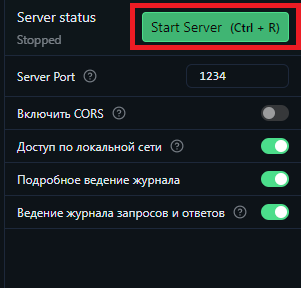

# Топовый проект в сфере ML
Типы данных для обученя: 
- pdf 
- doc 
- docx

Папки:
- dataset_input -- входной набор данных для дообучения модели
- dataset -- обработанный наброр данных
- vectorstores -- папка сохранений для embeddins

# Описание исполняемых файлов
- pdf_convector -- набор функций конвертации файлов в pdf для дльнейшей работы
- localEmbeddings -- класс emebeddings для работы с lm studio
- file_message -- набор функций для работы с патками
- vectorstores -- набор функций для работы с векторным хранилищем
- api -- запуск api для работы в других приложениях
- model -- работа с моделями

# Инструкция для запуска
1. Установите Lm Studio (https://lmstudio.ai/) 
    - Скачайте модель для Embeddings: nomic-embed-text-v1.5-GGUF/nomic-embed-text-v1.5.f32.gguf
    - Скачайте модель для Обработки текста: Hermes-3-Llama-3.1-8B-GGUF/Hermes-3-Llama-3.1-8B.Q4_K_M.gguf
    - PS: модель для обработки можно использывать ЛЮБУЮ, НО придеться преерписывать выод в model.py 
    для Embeddings не получиться, так как надо будет преписывать класс в LocalEmbeddings.py
    - Запустрите локальный ссервер и подключите скаченные модели
    
2. Установите библиоткеи для python. Вы полните команды из pip.md
3. В файле конфигурации:
    - base_url_* -- это ip полученные в ходе запуска локального сервера
    - model_* -- это название моделей
4. Переместите файлы для дообучеия в dataset_input
- Для консоьного запуска
5. Запустите блокнот main.ipymb
- для запуска сайта
5. Если желаете работать с api то после пункта 4, откройте командную строку перейдите в директорию проекта и выполните команду python -m uvicorn API:app --reload

# Доп. ссылки:
- https://soshnikov.com/ai/creating-problem-domain-specific-chat-assistant-with-yandex-gpt-and-langchain-ru/